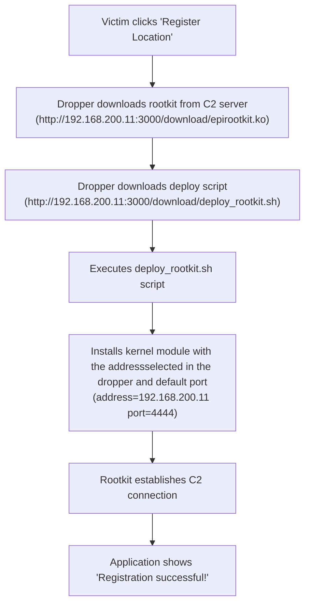

## Overview

The dropper is a social engineering tool disguised as "NeoGeoLoc - Location Registration System". It provides a realistic attack simulation where the victim downloads and runs what appears to be a legitimate location registration application.

## Prerequisites

1. **C2 Server**: [Attacker VM Setup]() - Must be running
2. **Dropper Built**: Run `./deploy_c2.sh -d` to build the dropper and start landing page

## Build Process

The dropper is built from Node.js source code and packaged as a standalone executable:

```bash
# Build dropper manually (if needed)
cd dropper
./build.sh
```

**What happens during build**:
- Packages `dropper.js` with embedded HTML/CSS assets
- Creates `NeoGeoLoc` binary using `pkg` 
- Copies binary to `attacking_program/public/downloads/`
- Makes it available at: `http://192.168.200.11:3000/download/NeoGeoLoc`

## Victim Instructions

### Step 1: Access the Landing Page

The victim should navigate to: `http://192.168.200.11:8080`



**What the victim sees**: A professional-looking download page for "NeoGeoLoc - Location Registration System"

**Technical details**: The landing page server proxies the download from the C2 server (`http://192.168.200.11:3000/download/NeoGeoLoc`)

### Step 2: Download the Application

1. **Click the download button** on the landing page
2. **Save the file** to Downloads folder (saved as `NeoGeoLoc`)
3. **Make it executable**:
   ```bash
   chmod +x ~/Downloads/NeoGeoLoc
   ```

### Step 3: Run the Application

1. **Double-click** the downloaded file, or run from terminal:
   ```bash
   ~/Downloads/NeoGeoLoc
   ```

2. **Application interface available at `http://localhost:8888`**:



**Interface elements**:
- Server address field (pre-filled with server URL)
- "Register Location" button
- Professional appearance to avoid suspicion

### Step 4: Register Location

1. **Click "Register Location"** button
2. **Wait for confirmation** - Application shows "Processing..."
3. **Success message** appears: "Location registered successfully!"

**Behind the scenes**: The application automatically downloads and installs the rootkit during this process.

## Technical Process Flow

What happens behind the scenes when the victim clicks "Register Location":




